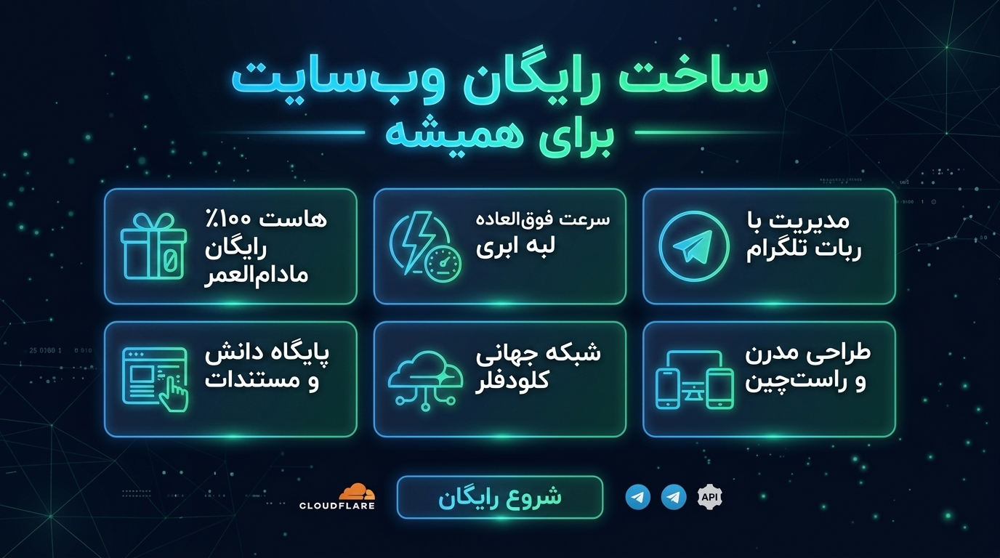
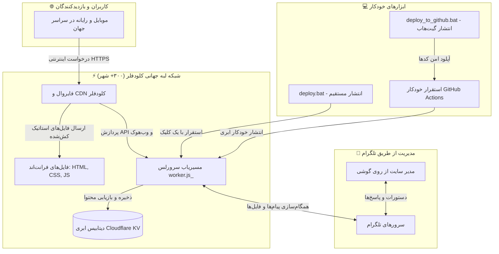

<div align="center" dir="rtl">

# 🚀 زیرووِب (ZeroWeb)
### پلتفرم ساخت وب‌سایت ۱۰۰٪ رایگان و ابری با مدیریت تلگرام

<p align="center">
  <a href="README.fa.md"></a>&nbsp;
  <a href="README.md"></a>
</p>

<p align="center">
  
  
  
  
  
  <a href="LICENSE"></a>
</p>



<p align="center">
  <b>یک وب‌سایت فوق‌العاده سریع، امن و مدرن با تاخیر لود زیر ۵۰ میلی‌ثانیه بسازید. بدون پرداخت حتی یک ریال هزینه هاست، با کنترل پنل تلگرام از روی گوشی، پایگاه دانش و مقالات، و شخصی‌سازی ۱۰۰٪ فقط از طریق فایل <code>.env</code>.</b>
</p>

[شروع سریع و استقرار](#-راه‌اندازی-فوری-استقرار-با-یک-کلیک) • [کنترل پنل تلگرام](#-راهنمای-کامل-سیستم-مدیریت-تلگرام-cms) • [تنظیمات .env](#-فرهنگ-جامع-تنظیمات-env) • [انتشار در گیت‌هاب](#-انتشار-با-یک-کلیک-در-گیت‌هاب-و-cicd) • [معماری سیستم](#-معماری-فنی-پلتفرم) • [English Guide](README.md)

</div>

---

<div dir="rtl">

## 💡 چرا این پلتفرم بی‌رقیب است؟

راه‌اندازی سایت‌های سنتی (مثل وردپرس) نیازمند خرید هاست ماهانه، تمدید گواهی SSL، مدیریت دیتابیس‌های سنگین و مواجهه با کندی سرعت است. این پروژه با بهره‌گیری از **زیرساخت لبه ابری (Serverless Edge) کلودفلر** تمام این موانع را از میان برداشته است:

| قابلیت و ویژگی | هاست‌های اشتراکی / وردپرس | 🚀 این پلتفرم ابری کلودفلر |
| :--- | :--- | :--- |
| **هزینه ماهانه هاست** | ۳۰۰ تا ۸۰۰ هزار تومان ماهانه | **کاملاً رایگان برای همیشه (۰ تومان)** |
| **سرعت و تاخیر لود (CDN)** | ۲۰۰ تا ۱۰۰۰ میلی‌ثانیه | **کمتر از ۵۰ میلی‌ثانیه در ۳۰۰+ شهر دنیا** |
| **گواهی امنیتی SSL** | نیازمند تمدید یا هزینه | **گواهی SSL خودکار، امن و رایگان** |
| **امنیت و ضد DDoS** | نیازمند افزونه و فایروال پولی | **محافظت لایه سازمانی با هوش مصنوعی کلودفلر** |
| **سیستم مدیریت محتوا** | پنل‌های سنگین با لاگین پیچیده | **ربات تلگرامی تعاملی و هوشمند از روی موبایل** |
| **شخصی‌سازی سایت** | دستکاری کدهای قالب و دیتابیس | **فقط با ویرایش یک فایل ساده `.env`** |
| **روش استقرار و آپلود** | FTP / cPanel پیچیده | **استقرار واقعی با یک کلیک (`deploy.bat`)** |

---

## ✨ امکانات و قابلیت‌های کلیدی

* **💰 میزبانی ۱۰۰٪ رایگان مادام‌العمر:** استفاده کامل از پلن رایگان Cloudflare Workers و Pages با ۱۰۰,۰۰۰ درخواست در روز و پهنای باند نامحدود.
* **🤖 سیستم مدیریت محتوای کامل تلگرام (Telegram Bot CMS):**
  * دریافت لحظه‌ای پیام‌ها و فرم‌های تماس بازدیدکنندگان مستقیماً در چت خصوصی تلگرام شما.
  * پاسخ مستقیم به پیام کاربر در تلگرام برای انتشار خودکار در بخش پرسش و پاسخ (Q&A) سایت!
  * آپلود مستقیم فایل‌های مستندات، PDF و مقالات از داخل تلگرام به سایت.
  * تنظیم و تغییر بنر اعلانات بالای سایت در چند ثانیه با دستورات ربات.
  * مشاهده آمار تلمتری و تعداد بازدیدکنندگان سایت به‌صورت زنده.
* **🎨 طراحی مدرن شیشه‌ای (Glassmorphic):** حالت تاریک (Dark Mode) و روشن، پس‌زمینه ذره‌ای متحرک (Particle Canvas)، انیمیشن‌های روان و پشتیبانی کامل و اصولی از فونت فارسی وزیرمتن و زبان‌های راست‌چین (RTL).
* **📚 پایگاه دانش و کتابخانه مستندات (`/docs.html`):** بخش مقالات و مستندات با جستجوی بلادرنگ متنی، دسته‌بندی موضوعی و خوانش فوری بدون نیاز به پایگاه داده سنگین.
* **⚙️ شخصی‌سازی ۱۰۰٪ بدون کدنویسی:** تغییر نام سایت، عنوان‌ها، بیوگرافی، لینک شبکه‌های اجتماعی، رنگ سازمانی و بخش‌های سایت بدون دست زدن به کدهای HTML/CSS.
* **⚡ استقرار با ۱ کلیک واقعی (مخصوص افراد مبتدی):** تنها با دابل‌کلیک روی `deploy.bat`، بررسی پیش‌نیازها، نصب ابزارها، ورود به کلودفلر و پابلیش سایت انجام شده و سایت زنده شما فوراً در مرورگر باز می‌شود!
* **🐙 پابلیشر ۱ کلیک گیت‌هاب:** فایل `deploy_to_github.bat` پروژه شما را با حفاظت سخت‌گیرانه از فایل‌های محرمانه روی گیت‌هاب آپلود کرده و پایپ‌لاین استقرار خودکار GitHub Actions را فعال می‌کند.

---

## 🏗 معماری فنی پلتفرم



---

## 🚀 راه‌اندازی فوری (استقرار با یک کلیک)

این پلتفرم به‌گونه‌ای ساخته شده که **هر کاربری بدون کوچک‌ترین دانش فنی یا کار با خط فرمان** بتواند در کمتر از ۲ دقیقه سایت خود را جهانی کند.

### پیش‌نیازها
1. سیستم‌عامل ویندوز، مک یا لینوکس.
2. نرم‌افزار رایگان [Node.js](https://nodejs.org/) (نسخه ۱۸ به بالا).
3. یک حساب رایگان در [سایت کلودفلر](https://dash.cloudflare.com/sign-up) (ثبت‌نام ۳۰ ثانیه‌ای، بدون نیاز به کارت بانکی).

### مراحل استقرار در ویندوز:

1. این پوشه را باز کنید.
2. روی فایل **`deploy.bat`** دابل‌کلیک کنید.
3. تمام مراحل زیر **به‌صورت خودکار** انجام می‌شوند:
   * بررسی حضور Node.js (در صورت عدم وجود، نصب خودکار یا باز کردن صفحه دانلود).
   * ایجاد فایل پیکربندی `.env` از روی الگو در صورت عدم وجود.
   * نصب خودکار Wrangler و ابزارهای لازم (تنها برای اولین بار).
   * باز شدن خودکار مرورگر برای تایید اتصال به کلودفلر (تنها بار اول، کافیست روی **Allow** کلیک کنید).
   * بهینه‌سازی، ساخت و فشرده‌سازی فایل‌های فرانت‌اند و نقشه‌های سایت.
   * استقرار سایت روی شبکه ابری کلودفلر و استخراج **آدرس زنده و اختصاصی سایت شما**.
   * **باز شدن خودکار وب‌سایت منتشر شده در مرورگر شما!**

> [!TIP]
> **کاربران مک / لینوکس:** دستور `npm install && npm run deploy` را در ترمینال اجرا نمایید.  
> **کاربران پاورشل:** می‌توانید از اسکریپت `./deploy.ps1` استفاده کنید.

---

## ⚙️ فرهنگ جامع تنظیمات (`.env`)

تمام محتوا، متون، رنگ‌ها و بخش‌های وب‌سایت با ویرایش فایل متنی `.env` کنترل می‌شوند.

<details>
<summary><b>🔍 برای مشاهده لیست کامل و فارسی متغیرهای .env کلیک کنید</b></summary>

```env
# ==============================================================================
# ۱. مشخصات و هویت اصلی وب‌سایت
# ==============================================================================
SITE_NAME="وبسایت من"
SITE_TITLE="وبسایت من | پورتفولیو و پایگاه دانش"
SITE_SUBTITLE="میزبانی ابری کلودفلر با مدیریت تلگرام"
SITE_DESCRIPTION="پلتفرم رایگان، فوق‌سریع و مدرن روی شبکه ابری Cloudflare"
SITE_AUTHOR="نام شما"
SITE_DOMAIN=""                         # به‌صورت خودکار پس از اولین deploy تنظیم می‌شود
SITE_LANG="fa"                         # زبان سایت: 'fa' فارسی یا 'en' انگلیسی
SITE_DIR="rtl"                         # چیدمان: 'rtl' راست‌چین یا 'ltr' چپ‌چین
DEFAULT_THEME="dark"                   # پوسته پیش‌فرض: 'dark' تاریک یا 'light' روشن
ACCENT_COLOR="#3b82f6"                 # رنگ سازمانی اصلی (کد هگز)

# ==============================================================================
# ۲. بخش هیرو (بالای صفحه اصلی)
# ==============================================================================
HERO_BADGE="⚡ میزبانی ۱۰۰٪ رایگان · کلودفلر · سیستم مدیریت تلگرام"
HERO_TITLE="ساخت و راه‌اندازی رایگان وب‌سایت"
HERO_SUBTITLE="کلودفلر و سیستم مدیریت تلگرام"
HERO_LEAD="وب‌سایت شخصی و حرفه‌ای خود را به‌صورت کاملاً رایگان راه‌اندازی کنید."
HERO_CTA_PRIMARY_TEXT="شروع و ارتباط"
HERO_CTA_PRIMARY_URL="#order"
HERO_CTA_SECONDARY_TEXT="مشاهده مستندات"
HERO_CTA_SECONDARY_URL="/docs.html"

# ==============================================================================
# ۳. راه‌های ارتباطی و شبکه‌های اجتماعی
# ==============================================================================
CONTACT_EMAIL="info@example.com"
TELEGRAM_USERNAME="your_username"      # آیدی تلگرام شما (بدون @)
GITHUB_URL="https://github.com/your_username"
TWITTER_URL=""
LINKEDIN_URL=""
INSTAGRAM_URL=""
YOUTUBE_URL=""

# ==============================================================================
# ۴. سیستم مدیریت محتوای تلگرام (اختیاری)
# ==============================================================================
BOT_TOKEN=""                           # توکن ربات از BotFather@
CHAT_ID=""                             # شناسه عددی تلگرام از userinfobot@
ADMIN_PASS="رمز_عبور_مدیریتی_دلخواه"    # رمز دسترسی ادمین

# ==============================================================================
# ۵. فعال / غیرفعال‌سازی بخش‌های سایت
# ==============================================================================
SHOW_STATS="true"                      # نمایش شمارنده‌های آماری
SHOW_SERVICES="true"                   # نمایش بخش خدمات
SHOW_PORTFOLIO="true"                  # نمایش کارت‌های معماری
SHOW_DOCS="true"                       # فعال بودن کتابخانه مستندات
SHOW_QA="true"                         # فعال بودن بخش پرسش و پاسخ
```

</details>

> [!NOTE]
> هر زمان که متنی یا تنظیمی را در `.env` تغییر دادید، کافیست مجدداً روی **`deploy.bat`** دابل‌کلیک کنید تا تغییرات در عرض چند ثانیه جهانی شوند!

---

## 🤖 راهنمای کامل سیستم مدیریت تلگرام (CMS)

با فعال‌سازی ربات تلگرام، کل وب‌سایت شما از داخل اپلیکیشن تلگرام در گوشی هوشمندتان مدیریت می‌شود.

```
                      ┌────────────────────────────────┐
                      │    مراحل ۲ دقیقه‌ای ساخت ربات  │
                      └───────────────┬────────────────┘
                                      │
          ┌───────────────────────────┴───────────────────────────┐
          ▼                                                       ▼
۱. پیام به BotFather@ در تلگرام                                ۲. پیام به userinfobot@ در تلگرام
   ارسال دستور newbot/ و کپی توکن BOT_TOKEN                      ارسال دستور start/ و کپی شناسه CHAT_ID
          │                                                       │
          └───────────────────────────┬───────────────────────────┘
                                      ▼
             ۳. قرار دادن توکن و چت‌آیدی در .env و اجرای مجدد deploy.bat!
```

### راهنمای دستورات ربات

| دستور | کاربرد و عملکرد |
| :--- | :--- |
| **`/start`** | باز کردن منوی شیشه‌ای و دکمه‌ای مدیریت کامل وب‌سایت. |
| **`/add_note`** | ارسال هر فایل، جزوه، PDF یا یادداشت برای انتشار خودکار در پایگاه دانش سایت. |
| **`/announce`** | تغییر یا غیرفعال‌سازی بنر اعلانات زنده بالای وب‌سایت. |
| **`/stats`** | گزارش زنده بازدیدکنندگان، وضعیت سیستم و درخواست‌های اخیر. |
| **پاسخ به پیام مخاطب** | با ارسال فرم تماس توسط کاربران سایت، پیام در تلگرام شما می‌آید؛ با Reply کردن به آن پیام، پاسخ شما در سایت منتشر می‌شود! |

---

## 🐙 انتشار با یک کلیک در گیت‌هاب و CI/CD

این پروژه مجهز به یک پابلیشر اختصاصی است که نسخه پشتیبان پروژه را با رعایت حداکثر امنیت روی گیت‌هاب قرار می‌دهد.

### مراحل انتشار در گیت‌هاب:
1. روی فایل **`deploy_to_github.bat`** (یا `./deploy_to_github.ps1`) دابل‌کلیک کنید.
2. اسکریپت مراحل زیر را اجرا می‌کند:
   * مخزن Git محلی را ایجاد و شاخه `main` را تنظیم می‌کند.
   * **تضمین امنیت صددرصدی:** فایل `.env`، کلیدها و توکن‌های تلگرام را به‌صورت اجباری محافظت می‌کند تا **هرگز** در گیت‌هاب آپلود نشوند.
   * در صورت لاگین بودن در GitHub CLI (`gh`)، مخزن را با ۱ کلیک در اکانت شما می‌سازد (عمومی یا خصوصی).
   * کدهای شما را پوش کرده و صفحه مخزن را در مرورگر باز می‌کند!

### استقرار خودکار ابری (GitHub Actions):
با فعال بودن فایل `.github/workflows/deploy.yml`، هر بار که کدی را در گیت‌هاب پوش کنید، کلودفلر به‌طور خودکار سایت شما را بیلد و دیپلوی می‌کند!

> [!IMPORTANT]
> برای اتصال استقرار خودکار GitHub Actions به اکانت کلودفلر:
> ۱. در صفحه مخزن گیت‌هاب به **Settings** -> **Secrets and variables** -> **Actions** بروید.
> ۲. مقدار `CLOUDFLARE_API_TOKEN` را تعریف کنید (از بخش My Profile -> API Tokens در کلودفلر).
> ۳. مقدار `CLOUDFLARE_ACCOUNT_ID` را قرار دهید (از منوی کناری داشبورد کلودفلر).

---

## 🌐 اتصال دامنه اختصاصی

به‌صورت پیش‌فرض، سایت شما فوراً روی ساب‌دامین رایگان کلودفلر در دسترس است:
`https://zeroweb.<subdomain>.workers.dev` (یا آدرس اختصاصی Pages شما)

برای اتصال دامنه دلخواه خودتان (مثلاً `mysite.ir` یا `mysite.com`):
1. در داشبورد کلودفلر وارد پروژه Workers خود شوید.
2. به بخش **Settings** -> **Domains & Routes** بروید.
3. روی دکمه **Add Custom Domain** کلیک کرده و نام دامنه را وارد کنید.
4. کلودفلر DNS را ست کرده و گواهی رایگان SSL صادر می‌کند!
5. *(اختیاری)* نام دامنه را در فیلد `CUSTOM_DOMAIN="mysite.com"` فایل `.env` وارد کنید تا نقشه‌های سایت و URLهای کنونیکال با دامنه شما هماهنگ شوند.

---

## 📁 ساختار فایل‌های پروژه

```
├── _worker.js                 # هسته مسیریابی لبه ابری، مدیریت APIها و وب‌هوک تلگرام
├── admin.js                   # موتور مدیریت تلگرام CMS و پنل مدیریتی
├── wrangler.toml              # مانیفست پیکربندی Cloudflare Workers & Pages
├── .env.example               # الگوی کامل و جامع تنظیمات با توضیحات دوزبانه
├── deploy.bat                 # اسکریپت استقرار ۱ کلیک برای ویندوز
├── deploy.ps1                 # اسکریپت استقرار ۱ کلیک برای پاورشل
├── deploy_to_github.bat       # پابلیشر ۱ کلیک گیت‌هاب برای ویندوز
├── deploy_to_github.ps1       # پابلیشر ۱ کلیک گیت‌هاب برای پاورشل
├── set_webhook.bat            # ابزار تنظیم مستقیم وب‌هوک ربات تلگرام
├── check_bot.bat              # ابزار تست و خطایابی اتصال ربات تلگرام
├── .github/
│   └── workflows/
│       └── deploy.yml         # پایپ‌لاین CI/CD استقرار خودکار از طریق گیت‌هاب
├── scripts/
│   ├── build_config.js        # تزریق و بیلد متغیرهای .env به فرانت‌اند و متادیتا
│   ├── deploy_runner.js       # ارکستریتور و مدیریت هوشمند استقرار ابری
│   ├── github_deployer.js     # مدیر خودکار ساخت مخزن و انتشار در گیت‌هاب
│   ├── sync_secrets.js        # همگام‌سازی کلیدهای محرمانه و ثبت وب‌هوک ربات
│   └── minify_assets.js       # مینیفای‌کننده حرفه‌ای فایل‌های CSS و JS
└── public/                    # دارایی‌ها و کدهای فرانت‌اند وب‌سایت
    ├── index.html             # اسکلت صفحه اصلی و بخش‌های تعاملی
    ├── docs.html              # پایگاه دانش و کتابخانه مستندات آنلاین
    ├── styles.css             # سیستم طراحی مینیفای‌شده شیشه‌ای (دارک و لایت)
    ├── styles.dev.css         # سورس CSS با توکن‌های طراحی و استایل‌های راست‌چین
    ├── script.js              # هسته مینیفای‌شده رفتار و منطق فرانت‌اند
    ├── script.dev.js          # سورس جاوااسکریپت توسعه
    ├── site-config.js         # کانفیگ آماده فرانت‌اند مشتق‌شده از .env
    ├── sitemap.xml            # نقشه سایت پویا برای سئو موتورهای جستجو
    ├── robots.txt             # دستورالعمل خزنده‌ها و ربات‌های جستجوگر
    └── docs/                  # فایل‌های مقالات و مستندات متنی و HTML
```

---

## 🔒 امنیت و حریم خصوصی

* **حفاظت کامل از اسرار:** فایل `.env` شما از طریق `.gitignore` کاملاً از Git حذف شده و کلیدهای ربات یا رمزهای عبور هرگز منتشر نمی‌شوند.
* **فایروال و محدودیت نرخ (Rate Limiting):** اندپوینت‌های ارتباطی مجهز به ضداسپم IP هستند.
* **تأیید اصالت وب‌هوک:** تمام ارتباطات ربات تلگرام با هدر امنیتی `X-Telegram-Bot-Api-Secret-Token` اعتبارسنجی می‌شوند.

---

## 📄 مجوز و استفاده

این پروژه تحت **مجوز MIT** منتشر شده و استفاده از آن برای اهداف شخصی، تجاری و آموزشی کاملاً آزاد و رایگان است.

<div align="center">

**ساخته‌شده با ❤️ برای توسعه‌دهندگان، فریلنسرها و کسب‌وکارهای ایرانی و بین‌المللی.**  
*اگر این قالب برای شما مفید بود، با ستاره دادن (⭐) در گیت‌هاب از پروژه حمایت کنید!*

</div>

</div>
