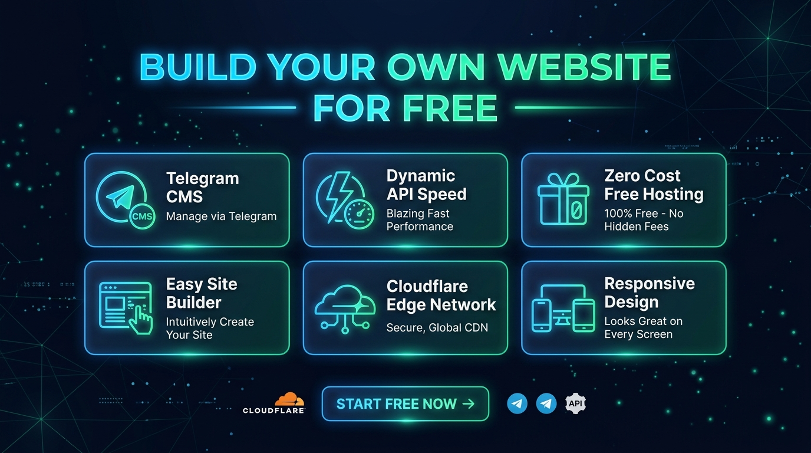
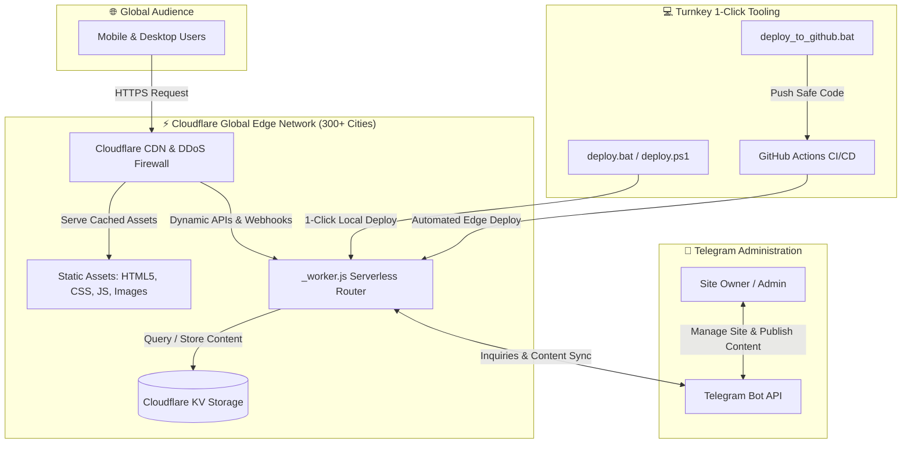

<div align="center">

# 🚀 ZeroWeb
### The $0-Forever Serverless Website Platform with Telegram CMS

<p align="center">
  <a href="README.md"></a>&nbsp;
  <a href="README.fa.md"></a>
</p>

<p align="center">
  
  
  
  
  
  <a href="LICENSE"></a>
</p>



<p align="center">
  <b>Deploy a lightning-fast, high-converting personal website with zero hosting bills, sub-50ms global CDN speed, built-in Telegram CMS, dynamic documentation library, and 100% configuration through a single <code>.env</code> file.</b>
</p>

[Quick Start](#-one-click-deployment) • [Telegram CMS](#-telegram-bot-cms-guide) • [Customization](#-configuration-dictionary-env) • [GitHub CI/CD](#-one-click-github-publishing--cicd) • [Architecture](#-system-architecture) • [Persian Guide (فارسی)](README.fa.md)

</div>

---

## 💡 Why This Platform?

Traditional websites require paying monthly hosting fees, renewing SSL certificates, managing databases, and dealing with slow page loads. This template eliminates all of that by leveraging **Cloudflare's serverless edge infrastructure**:

| Feature | Traditional Hosting / WordPress | 🚀 This Cloudflare Platform |
| :--- | :--- | :--- |
| **Monthly Hosting Bill** | $5 – $30 / month | **$0.00 (100% Free Forever)** |
| **Global Speed (CDN)** | 200ms – 1,000ms latency | **< 50ms in 300+ Edge Cities** |
| **SSL Certificate** | Paid add-on or manual renewal | **Automated Zero-Config SSL** |
| **DDoS & Security** | Extra plugin / paid firewall | **Enterprise-Grade Cloudflare Shield** |
| **Content Management** | Heavy dashboard / complex login | **Interactive Telegram Bot from Your Phone** |
| **Configuration** | Scattered database tables | **Single `.env` configuration file** |
| **Deployment** | Complex FTP / cPanel upload | **True 1-Click (`deploy.bat` / GitHub)** |

---

## ✨ Features at a Glance

* **💰 100% Zero-Cost Hosting:** Runs completely within Cloudflare's generous free tiers (100,000 daily worker requests, unlimited bandwidth on static assets).
* **🤖 Complete Telegram Bot CMS:**
  * Receive real-time contact form inquiries directly in your private Telegram chat.
  * Reply to inquiries on Telegram to publish answers live on the site's Q&A section.
  * Upload documents, PDF notes, and articles straight from Telegram.
  * Update the live site announcement banner in seconds via bot commands.
  * Monitor real-time site visitor analytics and telemetry.
* **🎨 Modern Glassmorphic Design:** Sleek dark & light theme modes, floating particle canvas background, fluid micro-animations, and full RTL (Persian/Arabic) & LTR support.
* **📚 Dynamic Documentation Library (`/docs.html`):** Built-in knowledge base with real-time text searching, category filtering, and instant article reader.
* **⚙️ 100% No-Code Customization:** Customize your website title, hero headline, biography, social links, brand colors, and section visibility solely by editing `.env`.
* **⚡ 1-Click Zero-Knowledge Deployer:** Double-click `deploy.bat`. It checks dependencies, auto-installs Wrangler, authenticates Cloudflare, deploys, and opens your live site in your browser.
* **🐙 1-Click GitHub Publisher:** Double-click `deploy_to_github.bat` to push to GitHub safely with automated secret protection and pre-built GitHub Actions CI/CD.

---

## 🏗 System Architecture



---

## 🚀 One-Click Deployment

Designed so that **anyone**, even without programming experience, can launch their website in less than 2 minutes.

### Prerequisites
* A computer running Windows, macOS, or Linux.
* A free [Cloudflare Account](https://dash.cloudflare.com/sign-up) (takes 30 seconds, no credit card required).
* [Node.js](https://nodejs.org/) (Version 18 or newer).

### Deployment Steps (Windows)

1. Download or clone this repository to your computer.
2. Double-click **`deploy.bat`**.
3. What happens automatically:
   * Checks Node.js (attempts automatic install via `winget` if missing).
   * Generates `.env` from template if you don't already have one.
   * Auto-installs Cloudflare Wrangler and build dependencies on first run.
   * Opens your browser for **1-click Cloudflare authorization** (first run only).
   * Compiles and minifies assets, sitemaps, and configurations.
   * Deploys to Cloudflare edge and captures your **real live `.workers.dev` link**.
   * Automatically opens your live website in your browser!

> [!TIP]
> **PowerShell Users:** You can also run `./deploy.ps1`.
> **macOS / Linux Users:** Run `npm install && npm run deploy`.

---

## ⚙️ Configuration Dictionary (`.env`)

Every aspect of your site is controlled by `.env`. You never need to touch HTML or CSS to rebrand your site.

<details>
<summary><b>🔍 Click here to expand the complete .env configuration reference</b></summary>

```env
# ==============================================================================
# 1. CORE BRANDING & IDENTITY
# ==============================================================================
SITE_NAME="My Awesome Platform"
SITE_TITLE="My Awesome Platform | Portfolio & Knowledge Base"
SITE_SUBTITLE="Turnkey Serverless Website on Cloudflare"
SITE_DESCRIPTION="A modern, high-performance personal website running globally on Cloudflare."
SITE_AUTHOR="Site Owner"
SITE_DOMAIN=""                         # Auto-detected on deploy (or set your custom domain)
SITE_LANG="en"                         # 'en' for English (LTR) or 'fa' for Persian (RTL)
SITE_DIR="ltr"                         # 'ltr' (Left-to-Right) or 'rtl' (Right-to-Left)
DEFAULT_THEME="dark"                   # 'dark' or 'light'
ACCENT_COLOR="#3b82f6"                 # Primary accent color (Hex format)

# ==============================================================================
# 2. HERO SECTION
# ==============================================================================
HERO_BADGE="⚡ 100% Free Hosting · Cloudflare · Telegram CMS"
HERO_TITLE="Launch Your Web Presence"
HERO_SUBTITLE="Global Edge Hosting & Telegram Control"
HERO_LEAD="Your personal high-performance platform running completely free on Cloudflare edge network."
HERO_CTA_PRIMARY_TEXT="Get in Touch"
HERO_CTA_PRIMARY_URL="#order"
HERO_CTA_SECONDARY_TEXT="Read Documentation"
HERO_CTA_SECONDARY_URL="/docs.html"

# ==============================================================================
# 3. CONTACT & SOCIAL PROFILES
# ==============================================================================
CONTACT_EMAIL="contact@example.com"
TELEGRAM_USERNAME="your_telegram_username"
GITHUB_URL="https://github.com/your_username"
TWITTER_URL=""
LINKEDIN_URL=""
INSTAGRAM_URL=""
YOUTUBE_URL=""

# ==============================================================================
# 4. TELEGRAM BOT CMS (OPTIONAL)
# ==============================================================================
BOT_TOKEN=""                           # From @BotFather
CHAT_ID=""                             # Your numeric Telegram ID from @userinfobot
ADMIN_PASS="SuperSecretPassword123!"   # Administrative password
SECRET_TOKEN=""                        # Webhook verification secret

# ==============================================================================
# 5. FEATURE TOGGLES
# ==============================================================================
SHOW_STATS="true"                      # Display statistics counters
SHOW_SERVICES="true"                   # Display services grid
SHOW_PORTFOLIO="true"                  # Display architecture cards
SHOW_DOCS="true"                       # Enable documentation library link
SHOW_QA="true"                         # Enable public Q&A section
```

</details>

> [!NOTE]
> Whenever you modify `.env`, simply re-run **`deploy.bat`**. It will update your site and publish changes globally in seconds!

---

## 🤖 Telegram Bot CMS Guide

Manage your entire website directly from your phone via Telegram.

```
                  ┌───────────────────────────────┐
                  │    Telegram Botfather Setup   │
                  └───────────────┬───────────────┘
                                  │
          ┌───────────────────────┴───────────────────────┐
          ▼                                               ▼
1. Send `/newbot` to @BotFather              2. Send `/start` to @userinfobot
   to get your `BOT_TOKEN`                      to get your numeric `CHAT_ID`
          │                                               │
          └───────────────────────┬───────────────────────┘
                                  ▼
3. Paste `BOT_TOKEN` & `CHAT_ID` into `.env` and run `deploy.bat`!
```

### Bot Commands Reference

| Command | Action |
| :--- | :--- |
| **`/start`** | Opens the interactive visual administrative control menu. |
| **`/add_note`** | Send any document, PDF, or markdown file to publish it to the documentation library. |
| **`/announce`** | Update or remove the live notification banner on top of the website. |
| **`/stats`** | View real-time visitor counts, request metrics, and system status. |
| **Reply to Inquiry** | When a visitor submits a contact form message, reply directly to the alert on Telegram to respond or publish the answer to the site's public Q&A! |

---

## 🐙 One-Click GitHub Publishing & CI/CD

This repository includes a dedicated publisher that backs up your code and automates deployments via GitHub Actions.

### Publishing to GitHub in 1 Click:
1. Double-click **`deploy_to_github.bat`** (or run `./deploy_to_github.ps1`).
2. The publisher will:
   * Initialize Git and ensure default branch is set to `main`.
   * **Security Protection:** Forcefully untracks `.env` so your private API keys and tokens are **never** pushed to GitHub.
   * Auto-detect your GitHub CLI login and offer to create a new repository under your account in 1 click.
   * Push your code to GitHub and open the repository in your browser!

### Automated CI/CD Deployment:
When your repository is on GitHub, every push to `main` automatically triggers **`.github/workflows/deploy.yml`** to build and deploy to Cloudflare.

> [!IMPORTANT]
> To enable automated Cloudflare deployment from GitHub Actions:
> 1. In your GitHub repository, go to **Settings** -> **Secrets and variables** -> **Actions**.
> 2. Add `CLOUDFLARE_API_TOKEN` (Create one in Cloudflare Dashboard -> My Profile -> API Tokens -> "Edit Cloudflare Workers").
> 3. Add `CLOUDFLARE_ACCOUNT_ID` (Found in your Cloudflare dashboard sidebar).

---

## 🌐 Custom Domains

By default, your website is instantly available at:
`https://zeroweb.<your-subdomain>.workers.dev` (or your chosen Pages URL)

To connect your own custom domain (e.g. `yourname.com`):
1. In Cloudflare Dashboard, go to **Workers & Pages** -> Select your project -> **Settings** -> **Domains & Routes**.
2. Click **Add Custom Domain** and enter your domain name.
3. Cloudflare will automatically route global DNS and issue a free SSL certificate!
4. *(Optional)* Set `CUSTOM_DOMAIN="yourname.com"` in your `.env` so canonical URLs and sitemaps match your domain.

---

## 📁 Project Structure

```
├── _worker.js                 # Cloudflare Worker router, APIs & Telegram webhook handler
├── admin.js                   # Telegram Bot CMS engine & administrative backend
├── wrangler.toml              # Cloudflare Workers & Assets deployment manifest
├── .env.example               # Exhaustive configuration template with Persian/English docs
├── deploy.bat                 # 1-Click Windows Cloudflare deployer
├── deploy.ps1                 # 1-Click PowerShell Cloudflare deployer
├── deploy_to_github.bat       # 1-Click Windows GitHub publisher
├── deploy_to_github.ps1       # 1-Click PowerShell GitHub publisher
├── set_webhook.bat            # Standalone Telegram webhook diagnostic utility
├── check_bot.bat              # Telegram Bot connectivity test script
├── .github/
│   └── workflows/
│       └── deploy.yml         # GitHub Actions automated CI/CD pipeline
├── scripts/
│   ├── build_config.js        # Compiles .env into public/site-config.js and metadata
│   ├── deploy_runner.js       # Turnkey Cloudflare deployment manager & browser launcher
│   ├── github_deployer.js     # Automated GitHub repository creator & publisher
│   ├── sync_secrets.js        # Syncs secrets to Cloudflare & registers bot webhooks
│   └── minify_assets.js       # Production asset minifier & bundle optimizer
└── public/                    # Production static web assets
    ├── index.html             # Homepage layout & interactive sections
    ├── docs.html              # Dynamic documentation & knowledge base
    ├── styles.css             # Minified glassmorphic design system
    ├── styles.dev.css         # Development source CSS with full token system
    ├── script.js              # Minified reactive UI engine
    ├── script.dev.js          # Development source JavaScript
    ├── site-config.js         # Hydrated site configuration from .env
    ├── sitemap.xml            # Dynamically generated search engine sitemap
    ├── robots.txt             # Search crawler policy rules
    └── docs/                  # Markdown & HTML documentation articles
```

---

## 🔒 Security & Privacy Notice

* **Zero Personal Leaks:** This repository contains zero hardcoded personal identifiers, credentials, or tracking tokens.
* **Secret Protection:** Your `.env` file is excluded from Git tracking via `.gitignore`.
* **Rate Limiting:** Built-in IP rate limiter protects `/api/contact` and `/api/order` endpoints from spam.
* **CSRF & Webhook Verification:** Telegram webhook requests are authenticated using `X-Telegram-Bot-Api-Secret-Token`.

---

## 📄 License

Distributed under the **MIT License**. Free for personal, commercial, and educational use.

<div align="center">

**Made with ❤️ for creators, developers, and entrepreneurs worldwide.**  
*If this template helps you, give it a ⭐ on GitHub!*

</div>
